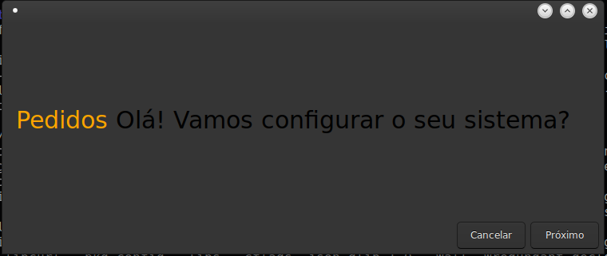

# Instalador Pedidos
> Programa Auxiliar para o aplicativo Calisto Pedidos.

### dependencias
<ul>
<li>GTK3</li>
<li>MariaDB</li>
<li>LibXML2</li>
</ul>

make

Calisto – jovictor210@gmail.com

## Contribuindo

1. Fork (<https://github.com/stdmedoth/InstaladorPedidos/fork>)
2. Crie seu branch (`git checkout -b feature/algo`)
3. Comite as alterações (`git commit -am 'Adicionando algo'`)
4. Suba como branch (`git push origin feature/algo`)
5. Crie um pull request
